# Youtube Data Analysis  🎞📊

## Summary 🚀


This project is a complete end-to-end data engineering solution as it goes from exploring and cleaning raw data of Youtube trending videos to analyzing it on Quicksight.

It includes the usage of relevant AWS services such as S3, Glue, Lambda, IAM and QuickSight.

---
## Objectives 🎯
- Analyze raw structured data in different formats (json, csv) stored in a "raw" S3 bucket
- Clean the data using different AWS services such as Lambda and Glue ETL. Store the clean data in parquet format in a new "cleansed" S3 bucket.
- Create a new analytics dataset in parquet format joining the cleansed datasets. Use Glue ETL for this process and store in a new "analytics" S3 bucket.
- Use Glue Crawlers and Data Catalog to infer the data schema and query the data at multiple stages (raw, cleansed, analytics) using Athena.
- Create a dashboard using QuickSight (BI tool) to analyze the data.

---
## Tech Diagram

Find below the tech design for this solution.

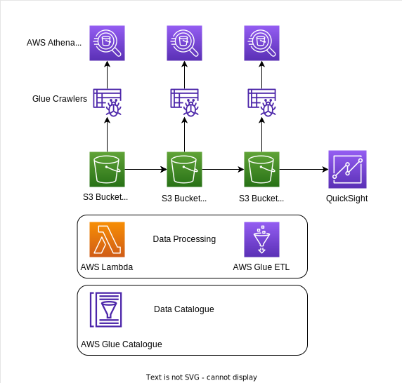


---
## Process

### 1. Data Exploration 🔍

The first step for this project is to get to know and understand the data to be processed. In this case, there are two types of structured raw data formats which are json and csv.

We will be establishing two different flows for cleaning and filtering these data, one for each data type.

One S3 bucket was created to store raw data (```de-youtube-raw-pablom11```) for which there are two different routes called:
- raw_statistics_category (json files)

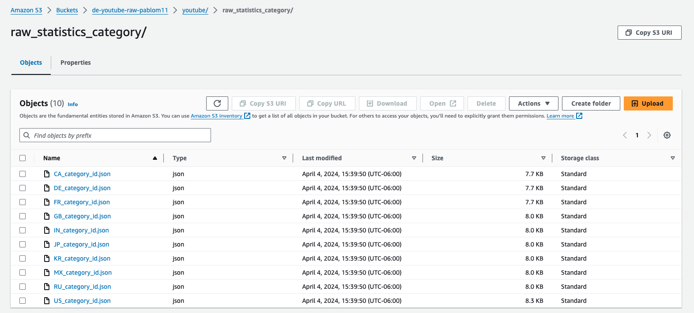

- raw_statistics (csv files)

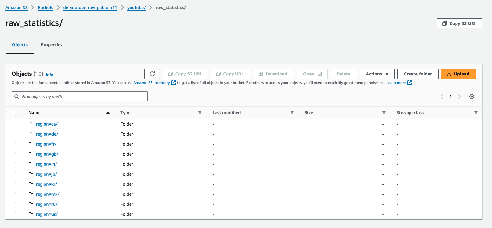

Note that csv files are stored utilizing partition logic, which facilitates partitioning the data when querying in athena for better filtering efficiency.

A glue crawler was utilized to create a glue catalog table in order to query the raw data in Athena.

_Glue crawlers:_
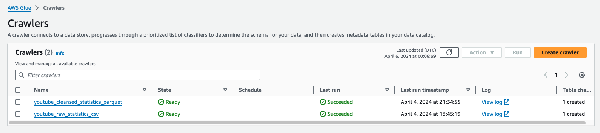

_Athena query raw data:_

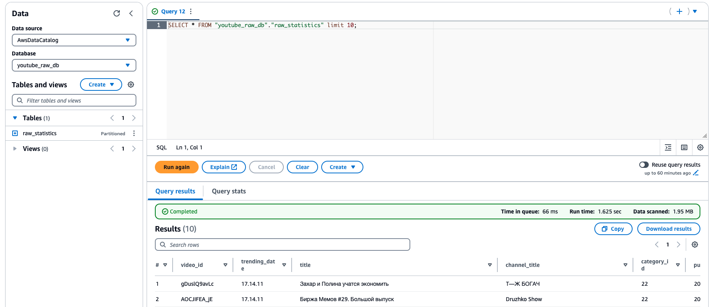

#### Additional Notes 📝

- The data was loaded to the S3 bucket routes using AWS CLI, to achieve this, a new user was configured and CLI access keys were created. Find below a code snippet of commands used to load the data:

````
# Copy json files
aws s3 cp . s3://de-youtube-raw-pablom11/youtube/raw_statistics_category/ --recursive --exclude "*" --include "*.json"

# Copy csv files to bucket partitions
aws s3 cp CAvideos.csv s3://de-youtube-raw-pablom11/youtube/raw_statistics/region=ca/
aws s3 cp DEvideos.csv s3://de-youtube-raw-pablom11/youtube/raw_statistics/region=de/
aws s3 cp FRvideos.csv s3://de-youtube-raw-pablom11/youtube/raw_statistics/region=fr/
aws s3 cp GBvideos.csv s3://de-youtube-raw-pablom11/youtube/raw_statistics/region=gb/
aws s3 cp INvideos.csv s3://de-youtube-raw-pablom11/youtube/raw_statistics/region=in/
aws s3 cp JPvideos.csv s3://de-youtube-raw-pablom11/youtube/raw_statistics/region=jp/
aws s3 cp KRvideos.csv s3://de-youtube-raw-pablom11/youtube/raw_statistics/region=kr/
aws s3 cp MXvideos.csv s3://de-youtube-raw-pablom11/youtube/raw_statistics/region=mx/
aws s3 cp RUvideos.csv s3://de-youtube-raw-pablom11/youtube/raw_statistics/region=ru/
aws s3 cp USvideos.csv s3://de-youtube-raw-pablom11/youtube/raw_statistics/region=us/
````


### 2. Data Processing & Cleaning ⚙️ 🧼

Two different data processing & cleaning flows were defined for this DE solution.

[1] For the first flow (json data), a lambda was utlized to normalize and flatten json data into a pandas data frame. The python library ```awswrangler``` was utilized in order to use pandas sdk to store the normalized data in parquet format in the ```de-youtube-cleansed-pablom11``` S3 bucket and create the related glue catalog table. A lambda Layer was required to achieve this. In order to automate this flow, a S3 trigger was configured to invoke the lambda every time a json object is created.

_Lambda configuration with S3 trigger:_

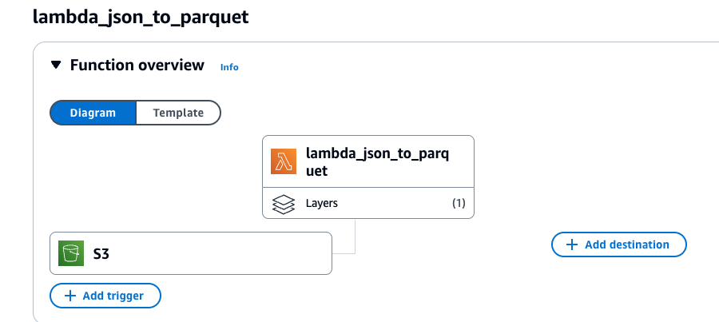

_S3 cleansed data (json to parquet):_
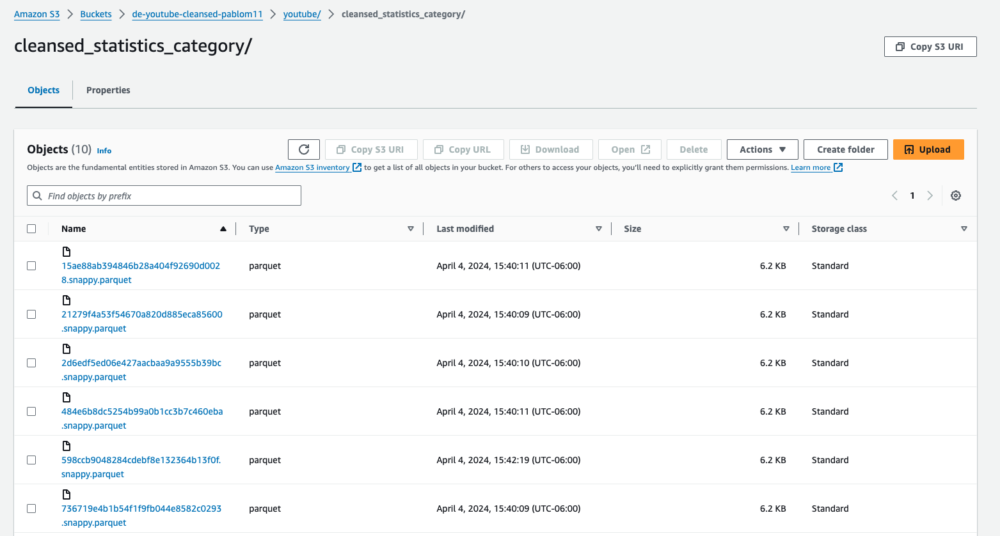


[2] For the second flow (csv data), Glue ETL service was utilized in order to filter, transform and store the data in parquet format in the clenased S3 bucket. Within the Glue ETL code, it was defined to also store the data utilizing partitions for each country (e.g. CA, US, GB)

_Glue ETL jobs:_
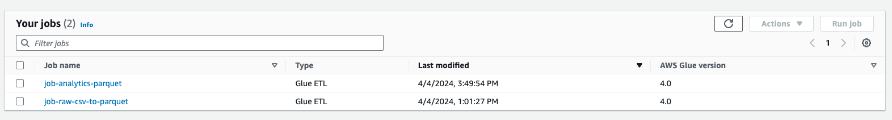

_S3 cleansed data (csv to parquet):_

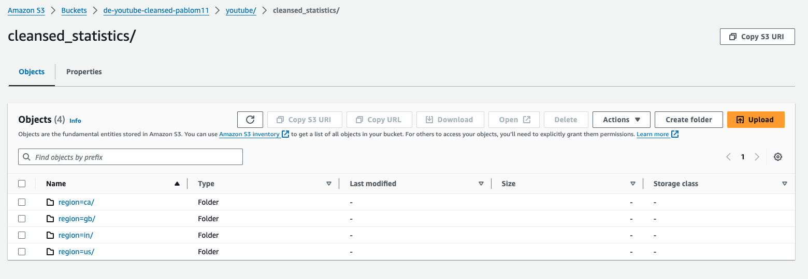

_Athena query cleansed data:_
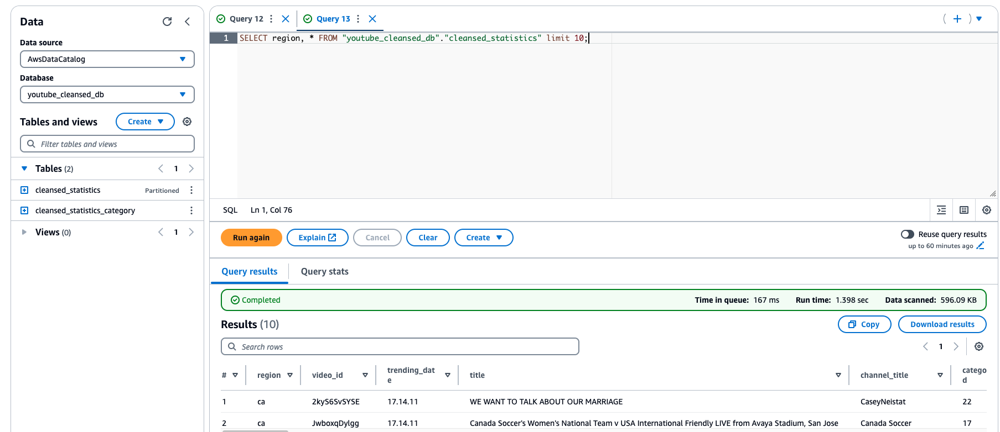

[3] Once all raw data was cleansed and stored in parquet format, the next step was to utilize both datasets from [1] and [2] outputs and create a merged dataset utilizing a SQL inner join. This was done utilizing another Glue ETL now with visual configuration, the output was stored in parquet format in the analytics S3 bucket ```de-youtube-analytics-pablom11``` and a Glue catalogue table was also defined in order to query with Athena.

_Glue ETL:_
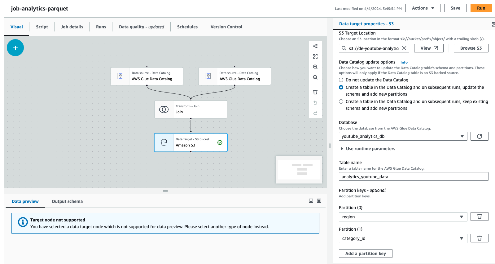

_Athena query analytics data:_
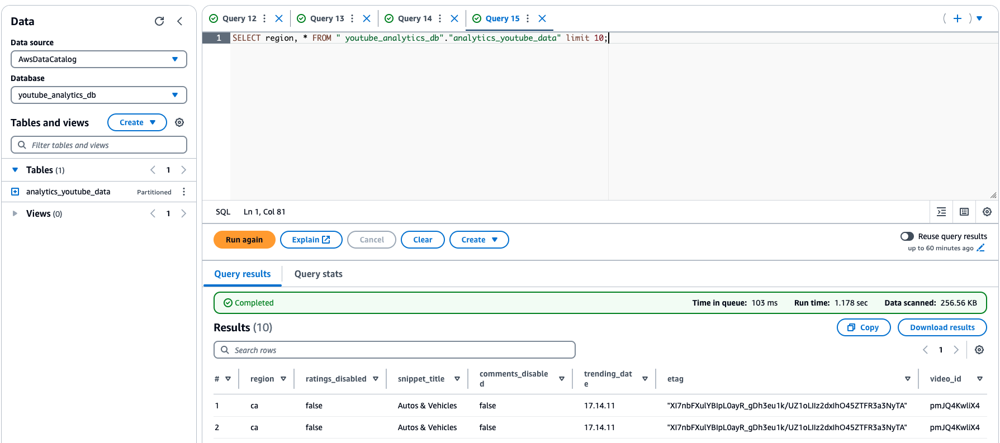

#### Additional Notes 📝
- ```awswrangler``` library requires a Lambda Layer with pandas SDK.
- IAM role for Glue crawlers was defined with appropiate permissions. Additional permissions were also configured to the lambda role.

### 3. Data Visualization 📈 💡

AWS QuickSight was utilized to create an interactive dashboard and visualize the data which was ready to be analyzed.
QuickSight allows connecting to Athena as datasource.

_QuickSight data source:_

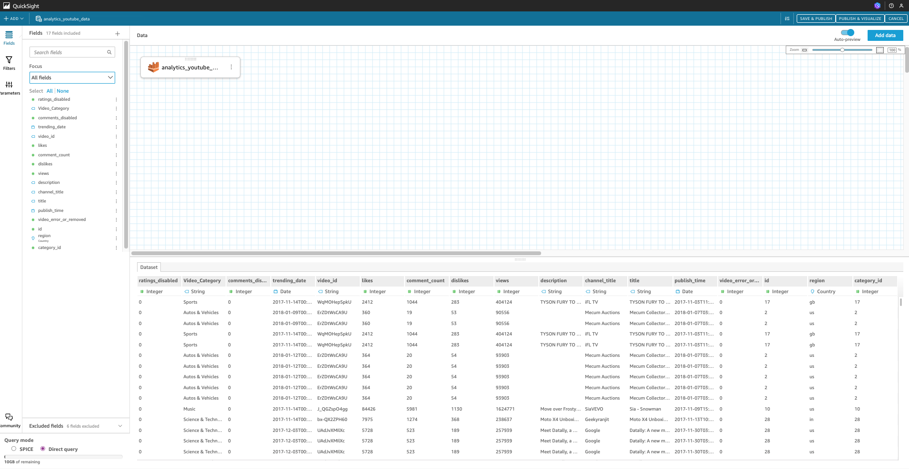


_QuickSight dashboard:_
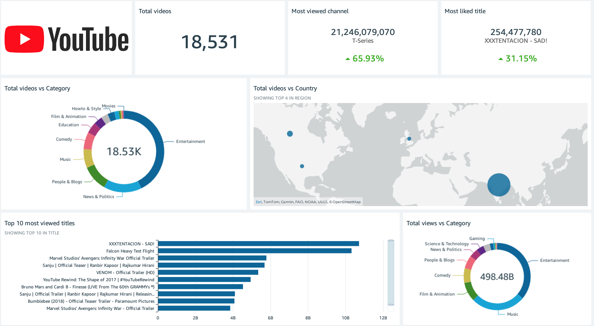

[Complete dashboard](other_files/Youtube_Dashboard_Output.pdf)

#### Additional Notes 📝

- Appropiate IAM permissions were also configured for the QuickSight role in order to be able to access and utilize the data.

---
## Conclusions 📍
- It is important to define the appropiate IAM roles and always considering rule of least-privelege (only provide required permissions and not more).
- QuickSight is a powerful data visualization tool mainly utilized for business intelligence. It has multiple features and also allows generating great reports with QuickSight Paginated Reports.
- Both Glue and Lambda were utilized as ETL tools for data transforming in this DE solution. It is important to consider pricing and data volume in order to select the best AWS service in real-life scenarios.
- It is important to have different buckets for each stage in the ETL process in order to better organize and work with the data.

## Project Credits ©️
- The data utilized in this project was sourced from Kaggle's [YouTube Trending Video Dataset](https://www.kaggle.com/datasets/rsrishav/youtube-trending-video-dataset/versions/1340).
- This project was executed based on [Darshil Parmar's](https://www.youtube.com/@DarshilParmar) Youtube video: [YouTube Data Analysis | END TO END DATA ENGINEERING PROJECT](https://www.youtube.com/watch?v=yZKJFKu49Dk&t=2427s).
 


