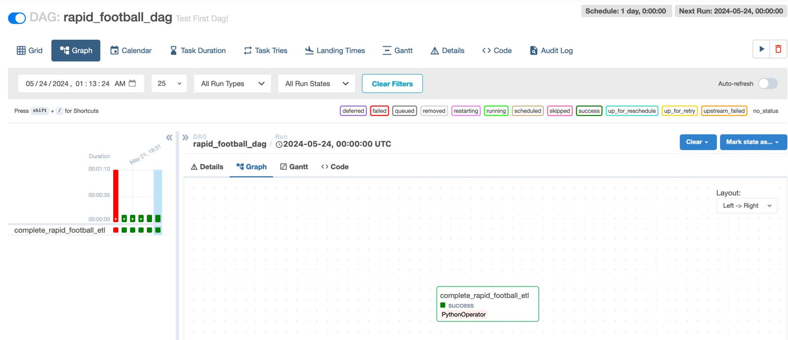

# Simple Airflow ETL  ⏰🌀

## Summary 🚀


This project is a simple airflow ETL which was deployed utilizing AWS Managed Workflows for Apache Airflow (MWAA). In the solution, data was extracted from Rapid Football API, it was processed with a simple python ETL, orchestrated with an airflow DAG and stored in a S3 bucket after applying simple data transformations.

---
## Objectives 🎯
- Introduction to airflow DAGs and AWS MWAA
- Learn how to orchestrate workflows utilizing Apache Airflow
- Extract and normalize data from an API


---
## Tech Diagram 📐

Find below the tech design for this solution.


---
## Concepts
**What is Apache Airflow?**

From Airflow's [official website](https://airflow.apache.org/docs/apache-airflow/stable/index.html):

- Apache Airflow is an open-source platform for developing, scheduling, and monitoring batch-oriented workflows. Airflow’s extensible Python framework enables you to build workflows connecting with virtually any technology. A web interface helps manage the state of your workflows. Airflow is deployable in many ways, varying from a single process on your laptop to a distributed setup to support even the biggest workflows.


**What is MWAA?**

From AWS MWAA [official website](https://docs.aws.amazon.com/mwaa/latest/userguide/what-is-mwaa.html):
- Amazon Managed Workflows for Apache Airflow is a managed orchestration service for Apache Airflow that you can use to setup and operate data pipelines in the cloud at scale. With Amazon MWAA, you can use Apache Airflow and Python to create workflows without having to manage the underlying infrastructure for scalability, availability, and security.

**What is a DAG?**
- DAG stands for Directed Acyclic Graphs, it represents a workflow that contains a collection of tasks.

**What is an Operator?**
- An Operator is a task and a DAG may have multiple Operators. Find some common Operators below:
    - BashOperator: Runs bash commands
    - PythonOperator: Runs python code
    - EmailOperator: Sends an email


---
## Process

### 1. Setting MWAA environment 🔍

#### Resources to create:

- **S3 Bucket**: An Amazon S3 bucket to store your DAGs and associated files, such as plugins.zip and requirements.txt. Your Amazon S3 bucket must be configured to **Block all public access**, with **Bucket Versioning enabled**.

    - Must add a "/dags" folder for dags
    - Optional adding a requirements.txt file
    - Optional adding a plugins zip file for DAG plugins

- **VPC**: The Amazon VPC networking components required by an Amazon MWAA environment. The specified VPC for the environment cannot be changed after creation. Private or Public routing can be selected. Security groups and Access Control Lists (ACLs) provide ways to control the network traffic across the subnets and instances in the VPC.

- **MWAA Environment**: An Amazon MWAA environment configured with the location of your Amazon S3 bucket, the path to your DAG code and any custom plugins or Python dependencies, and your Amazon VPC and its security group.

#### Steps for creating MWAA environment:

1. Create a new S3 bucket (block public access and bucket versioning enabled)

    1.1 Create folder called ```dags/``` to store the dags

    1.2 Add the ```requirements.txt``` file to the bucket which will contain dependencies needed.
    

    Example requirements file:
    ````
    requests
    pandas
    numpy
    s3fs
    ````


2. Create new MWAA environment (must be in same region as the S3 bucket)
    
    2.1 Select Airflow version for the environment and S3 bucket configuration

    

    2.2 Select the existing VPC or create a new one of needed. Choose Public Network access and configure proper security groups for inbound/outbound traffic.

    

    2.3 Choose environment configuration (size medium + works for Airflow)

    


#### Additional Notes 📝
- [Important]: If choosing Public Network Access, utilize appropiate Security Groups or ACLs.

- If new requirements are added to ```requirements.txt``` the enviroment must be re-deployed for syncing.

- If MWAA will interact with other AWS services, the IAM role must have appropiate permissions.


### 2. Writing Python ETL ⚙️ 

The ETL utilized in this solution extracts data from Rapid Football API, performs simple transformations and stores the output in a S3 bucket.


#### Data Extraction

````
    response = requests.get(url, headers=headers, params=querystring)
    fixtures = response.json()["response"]
````

#### Transform Data

````
df = pd.json_normalize(fixtures)

# Function to transform column names
    def rename_columns(df):
        renamed_columns = []
        for column in df.columns:
            renamed_columns.append(column.replace('.', '_'))
        return renamed_columns
    
    df.columns = rename_columns(df)
    df_sorted = df.sort_values(by='fixture_date')
````

#### Load Data

````
    df_sorted.to_csv("s3://pablomtb-burner-20240513-airflow/results/rapid_football_results_2010.csv")
````


Find the complete code in [rapid_api.py](scripts/rapid_api.py).

#### Additional Notes 📝
- The MWAA must have IAM permissions to interact with S3.
- ```s3fs``` library is required to load the data into S3.

### 3. Writing Simple DAG ⚙️ 

#### Setting default arguments

````
default_args = {
    'owner': 'airflow',
    'depends_on_past': False,
    'start_date': days_ago(0),
    'email': ['your_email@test.com'],
    'email_on_failure': False,
    'email_on_retry': False,
    'retries': 1,
    'retry_delay': timedelta(minutes=1)
}
````

#### Defining DAG with daily schedule

````
# Defining dag
dag = DAG (
    'rapid_football_dag',
    default_args = default_args,
    description = 'First Airflow DAG',
    schedule_interval = timedelta(days=1),
)
````

#### Defining and calling new PythonOperator

````
run_etl = PythonOperator(
    task_id='complete_rapid_football_etl',
    python_callable= run_rapid_football_etl,
    dag=dag
)

run_etl
````

Find the complete code in [rapid_dag.py](scripts/rapid_dag.py)


### 4. Accessing Airflow UI and running DAG

Once the code is created, the python scripts must be added to the ```dags/``` folder in the S3 bucket.


After adding the code, access the UI and the DAGs will be imported. The dag must be turned on and then it is possible to run it.

#### Airflow UI DAG


#### Airflow UI Graph View



#### Airflow UI Execution Logs


Once the DAG is executed, a CSV gets created in the S3 bucket. Find the results in the image below.


---
## Conclusions 📍
- Airflow provides a powerful platform for defining, scheduling, and monitoring workflows. It allows users to create Directed Acyclic Graphs (DAGs) to represent their workflows, making it easier to visualize and understand the sequence and dependencies of tasks.

- MWAA is a fully managed service, which means that AWS handles the provisioning, configuration, scaling, and maintenance of the Airflow environment. This reduces the operational burden on users.

## Project Credits ©️
- The data utilized in this project was extracted utilizing [Football Rapid API](https://rapidapi.com/api-sports/api/api-football).
- This project was inspired on a similar solution from [Darshil Parmar's](https://www.youtube.com/@DarshilParmar) youtube video: [Twitter Data Pipeline using Airflow for Beginners | Data Engineering Project
](https://www.youtube.com/watch?v=q8q3OFFfY6c&t=1864s).
 


