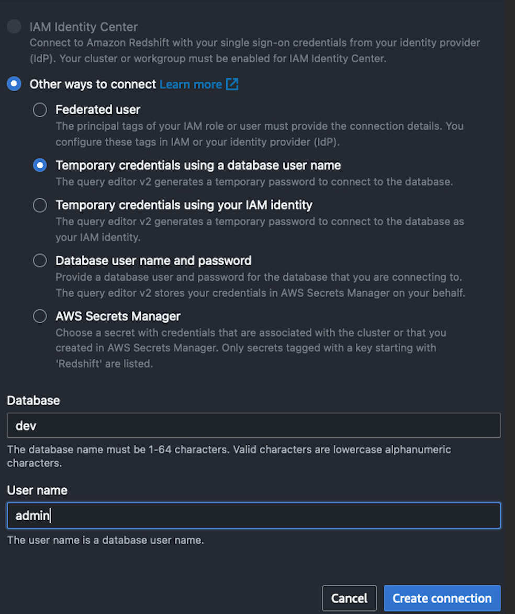
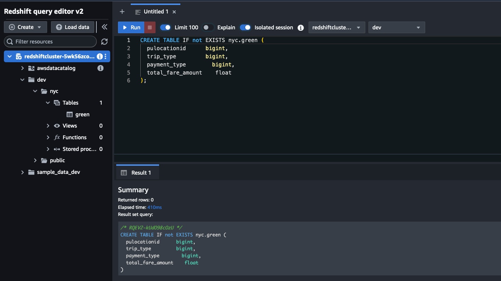
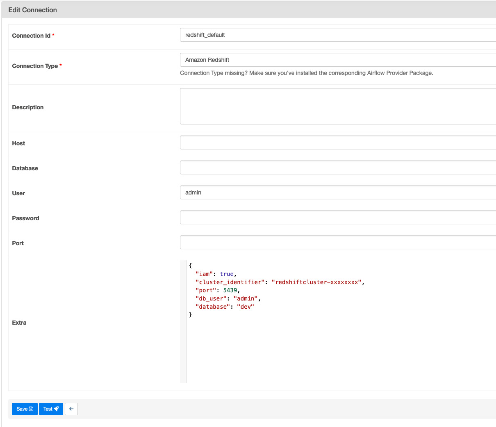
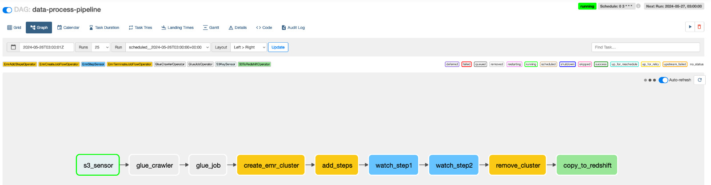
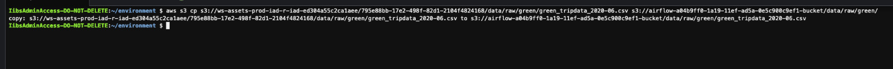
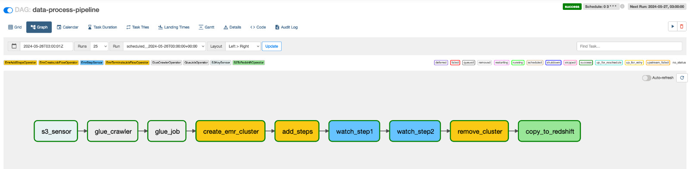
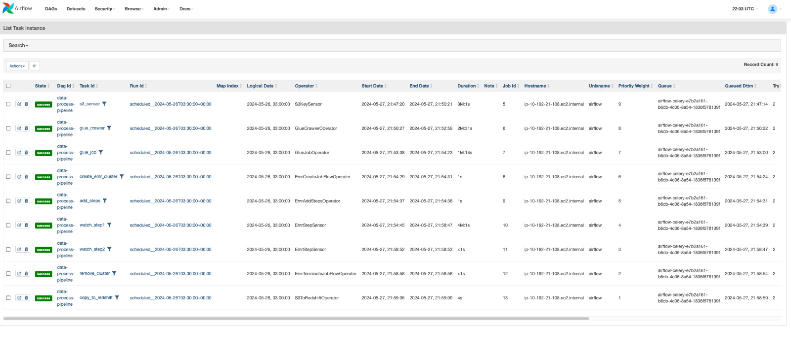
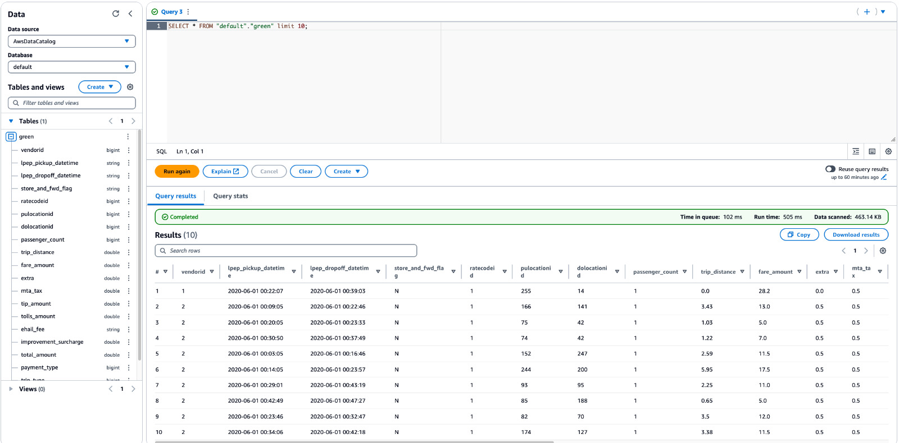
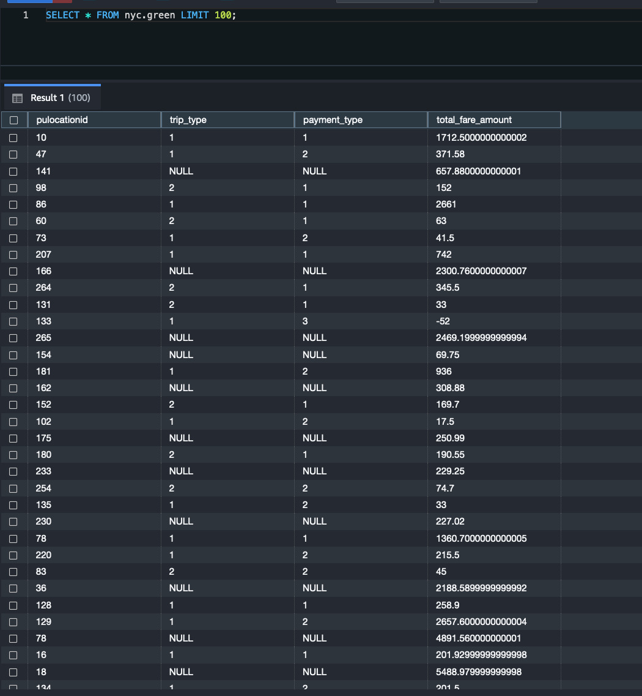

# Data Processing ETL with Airflow ⏰🌀

## Summary 🚀

This project consist on a data processing ETL managed with Apache Airflow through AWS MWAA. Two different ETL's were executed in order to transform data and aggregate it for data analytics with Glue and EMR. There are two data visualization points within the pipeline to query the data, which are upstream through Athena and downstream in Redshift.

---
## Objectives 🎯
- Create a end to end ETL orchestrated with Apache Airflow
- Follow one of MWAA workshops from AWS. Define infrastructure utilizing yml provided by them.
- Utilize popular AWS services as S3, Glue, EMR and Redshift


---
## Tech Diagram 📐

Find below the tech design for this solution.


The data pipeline from above consit on the following steps:

1. A S3 sensor that waits for a file to arrive into a S3 bucket (raw) 
2. A Glue Crawler to create a table in the Data catalog
3. A Glue ETL that will transform the data and store it in a different S3 bucket (transformed)
4. An EMR job that will create reporting datasets and store it in the last S3 bucket (aggregated)
5. As S3-to-Redshift copy of the aggregated data to query in the Datawarehouse

---
## Concepts

### AWS Services

The following definitions were pulled from [AWS documentation](https://aws.amazon.com).


- **S3:** Amazon Simple Storage Service (Amazon S3) is an object storage service that offers industry-leading scalability, data availability, security, and performance.
- **Glue Crawler + Data Catalog:** An AWS Glue crawler can be used to populate the AWS Glue Data Catalog with databases and tables.ETL jobs that you define in AWS Glue use these Data Catalog tables as sources and targets.
- **Glue ETL:**  AWS Glue is a serverless data integration service that makes it easy for analytics users to discover, prepare, move, and integrate data from multiple sources.
- **Elastic MapReduce (EMR):** Amazon EMR is a managed cluster platform that simplifies running big data frameworks, such as Apache Hadoop and Apache Spark, on AWS to process and analyze vast amounts of data. Amazon EMR also lets you transform and move large amounts of data into and out of other AWS data stores and databases, such as Amazon Simple Storage Service (Amazon S3) and Amazon DynamoDB.
- **Redshift:** Amazon Redshift is a fully managed, petabyte-scale data warehouse service in the cloud. Amazon Redshift Serverless lets you access and analyze data without all of the configurations of a provisioned data warehouse.
- **Managed Workflows for Apache Airflow (MWAA):** Amazon Managed Workflows for Apache Airflow is a managed orchestration service for Apache Airflow that you can use to setup and operate data pipelines in the cloud at scale. 
- **Cloud9:** A cloud-based integrated development environment (IDE) that lets you write, run, and debug your code with just a browser.


---
## Process

### 1. Deploying CloudFormation Stack

This project was done using as guide [AWS Workshop for MWAA](https://catalog.us-east-1.prod.workshops.aws/workshops/795e88bb-17e2-498f-82d1-2104f4824168/en-US/workshop/m1-processing). The [yml file](scripts/de-airflow-cf.yml) provided in the workshop will be utilized to deploy all required services, roles and policies for this pipeline.


### 2. Defining DAG Python ETL ⚙️ 

Utilized Cloud9 as cloud IDE to write and edit code for this solution. 

1. Created **data_process_pipeline_dag.py** file to use for the DAG.

````
mkdir ~/environment/dags
touch ~/environment/dags/data_pipeline.py
````

2. Imported required dependencies, defined DAG and its default arguments.

    2.1 Imported dependencies and operators

    ````
    from os import path
    from datetime import timedelta  
    import airflow  
    from airflow import DAG  
    from airflow.providers.amazon.aws.operators.emr import (
        EmrAddStepsOperator,
        EmrCreateJobFlowOperator,
        EmrTerminateJobFlowOperator,
    )
    from airflow.providers.amazon.aws.sensors.s3 import S3KeySensor
    from airflow.providers.amazon.aws.sensors.emr import EmrStepSensor
    from airflow.providers.amazon.aws.operators.glue import GlueJobOperator
    from airflow.providers.amazon.aws.operators.glue_crawler import GlueCrawlerOperator
    from airflow.providers.amazon.aws.transfers.s3_to_redshift import S3ToRedshiftOperator
    ````

    2.2 Defined DAG and default arguments

    ````
    # Defining default arguments
    default_args = {  
        'owner': 'airflow',
        'depends_on_past': False,
        'start_date': airflow.utils.dates.days_ago(1),
        'retries': 0,
        'retry_delay': timedelta(minutes=2),
        'provide_context': True,
        'email': ['airflow@example.com'],
        'email_on_failure': False,
        'email_on_retry': False
    }

    # Defining the DAG object
    dag = DAG(  
        dag_name,
        default_args=default_args,
        dagrun_timeout=timedelta(hours=2),
        schedule_interval='0 3 * * *'
    )
    ````

3. Defining DAG steps

    3.1 S3 Sensor
    - S3KeySensor: Checks if the file matching the specified pattern is present in the S3 bucket when it runs.
    ````
    s3_sensor = S3KeySensor(  
    task_id='s3_sensor',  
    bucket_name=S3_BUCKET_NAME,  
    bucket_key='data/raw/green*', 
    wildcard_match=True, 
    dag=dag  
    )
    ````

    3.2 Glue Crawler
    - GlueCrawlerOperator: Creates, updates and triggers an AWS Glue Crawler
    - Targets: This defines the data sources that the crawler will scan.
    ````
    glue_crawler_config = {
        "Name": "airflow-workshop-raw-green-crawler",
        "Role": GLUE_ROLE_ARN,
        "DatabaseName": "default",
        "Targets": {"S3Targets": [{"Path": f"{S3_BUCKET_NAME}/data/raw/green"}]},
    }

    glue_crawler = GlueCrawlerOperator(
        task_id="glue_crawler",
        config=glue_crawler_config,
        dag=dag)
    ````

    3.3 Glue ETL
    - GlueJobOperator:Create an AWS Glue Job. AWS Glue is a serverless Spark ETL service for running Spark Jobs on the AWS cloud. Language support: Python and Scala.
    - script_location: Location where the Glue ETL script is located
    ````
    glue_job = GlueJobOperator(
    task_id="glue_job",
    job_name="nyc_raw_to_transform",
    script_location=f"s3://{S3_BUCKET_NAME}/scripts/glue/nyc_raw_to_transform.py",
    s3_bucket=S3_BUCKET_NAME,
    iam_role_name="AWSGlueServiceRoleDefault",
    create_job_kwargs={"GlueVersion": "4.0", "NumberOfWorkers": 2, "WorkerType": "G.1X"},
    script_args={'--dag_name': dag_name,
                 '--task_id': 'glue_task',
                 '--correlation_id': correlation_id},
    dag=dag  
    )
    ````

    3.4 EMR Job
    - EmrCreateJobFlowOperator: Creates an EMR JobFlow, reading the config from the EMR connection.
    - EmrAddStepsOperator: An operator that adds steps to an existing EMR job_flow.

    ````
    cluster_creator = EmrCreateJobFlowOperator(
    task_id='create_emr_cluster',
    job_flow_overrides=JOB_FLOW_OVERRIDES,
    aws_conn_id='aws_default',
    emr_conn_id='emr_default',
    dag=dag
    )

    step_adder = EmrAddStepsOperator(
        task_id='add_steps',
        job_flow_id="{{ task_instance.xcom_pull('create_emr_cluster', key='return_value') }}",
        aws_conn_id='aws_default',
        steps=SPARK_TEST_STEPS,
        dag=dag
    )
    ````

    3.5 Adding Step checkers and terminating EMR Cluster
    - EmrStepSensor: Poll the state of the step until it reaches any of the target states; raise AirflowException on failure.
    - EmrTerminateJobFlowOperator: Operator to terminate EMR JobFlows.

    ````
    step_checker1 = EmrStepSensor(
    task_id='watch_step1',
    job_flow_id="{{ task_instance.xcom_pull('create_emr_cluster', key='return_value') }}",
    step_id="{{ task_instance.xcom_pull('add_steps', key='return_value')[0] }}",
    aws_conn_id='aws_default',
    dag=dag
    )

    step_checker2 = EmrStepSensor(
        task_id='watch_step2',
        job_flow_id="{{ task_instance.xcom_pull('create_emr_cluster', key='return_value') }}",
        step_id="{{ task_instance.xcom_pull('add_steps', key='return_value')[1] }}",
        aws_conn_id='aws_default',
        dag=dag
    )

    # Terminate Cluster after job has completed its execution
    cluster_remover = EmrTerminateJobFlowOperator(
        task_id='remove_cluster',
        job_flow_id="{{ task_instance.xcom_pull('create_emr_cluster', key='return_value') }}",
        aws_conn_id='aws_default',
        dag=dag
    )
    ````

    3.6 Copying data to Redshift
    - S3ToRedshiftOperator: copies data from a S3 Bucket into a Redshift table.
    ````
    copy_to_redshift = S3ToRedshiftOperator(
    task_id='copy_to_redshift',
    schema='nyc',
    table='green',
    s3_bucket=S3_BUCKET_NAME,
    s3_key='data/aggregated',
    copy_options=["FORMAT AS PARQUET"],
    dag=dag,
    )
    ````


    3.7 Setting up Dag pipeline
    ````
    s3_sensor >> glue_crawler >> glue_job >> cluster_creator >> step_adder >> step_checker1 >> step_checker2 >> cluster_remover >> copy_to_redshift

    ````

#### Additional Notes 📝
- Complete code in [data_process_pipeline_dag.py](scripts/data_process_pipeline_dag.py)


### 3. Defining Glue ETL and EMR Job

These python files are referenced in the steps of the DAG. The scripts are located within a S3 bucket.

- Code for Glue ETL: [nyc_raw_to_transform.py](scripts/nyc_raw_to_transform.py)
- Code for EMR Job: [nyc_aggregations.py](scripts/nyc_aggregations.py)

### 4. Configuring Redshift

A redshift cluster was created when deploying the CDK stack but additional configuration is required, to achieve so, these steps were followed:
- Open Redshift Query Editor V2
- Connect with temp credentials ```database = dev``` and ```username = admin```
- Take note of the cluster identifier as it is used in airflow's configurations



1. Create Schema

    ````
    CREATE schema nyc;

    ````

2. Create Table

    ````
    CREATE TABLE IF not EXISTS nyc.green (
    pulocationid      bigint,
    trip_type         bigint,
    payment_type        bigint,
    total_fare_amount    float
    );
    ````


3. Edit Redshift Configurations in Airflow's UI
    
    3.1 Click on admin > connections and edit ```redshift_default```.




### 5. Running DAG in MWAA

Once everything is set, the DAG should be turned on and the process will start. The DAG will wait for a file to reach the S3 bucket and trigger the sensor to continue with the rest of the steps.

Process waiting for a file in S3



Copying a file to S3 from Cloud9



Process execution successful



Airflow steps logs



As process was successful, data is now available for querying in the Data Catalog through Athena and further downstream in the Redshift table defined before.

Athena


Redshift


---
## Conclusions 📍
- Airflow is a powerful open-source tool that allows authoring, scheduling and monitoring workflows. There are multiple operators available for usage.

## Project Credits ©️
- This project was executed utilizing as reference [Amazon MWAA for Analytics Workshop](https://catalog.us-east-1.prod.workshops.aws/workshops/795e88bb-17e2-498f-82d1-2104f4824168/en-US) from AWS.
